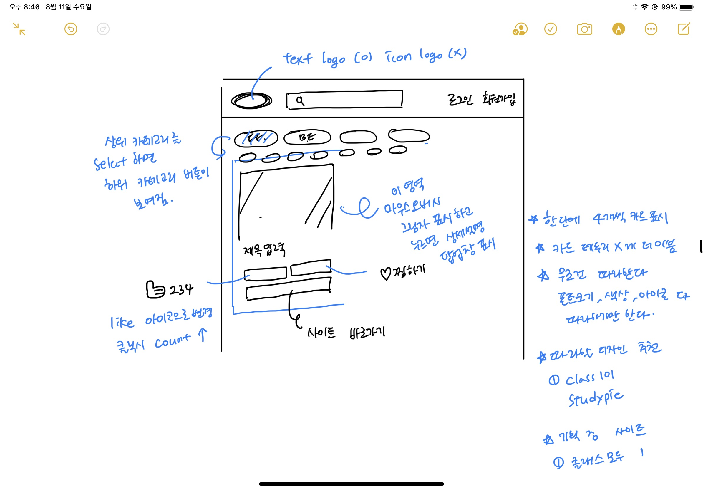

# Hanghae99 Team2 Toy project#1 (Linkgather)

- 주소: [linkgather.shop](https://www.linkgather.shop)
  

## 개요

* 프로젝트 명: Link Gather
* 개발기간: 210803~210828
* 개발인원: 김동우, 이지훈, 이미다, 황창환 (4명)
* 배포 문제 해결에 도움 주신 분: 이상현

## 프로젝트 설명

> 공부하는데 필요한 링크들을 모아서 올릴 수 있는 사이트.
>
> 저희 조는 다들 웹개발 초보자였기 때문에 본 부트캠프가 시작하기 전에 어떤 느낌인지 먼저 체험해 보고자 토이 프로젝트를 시작하게 되었습니다.
>
> 토이프로젝트의 주제는 저희가 공부하면서 필요한 사이트들의 링크를 모아두고 두고두고 볼 수 있는 웹 애플리케이션을 만들고자 했습니다.
>
> 방법은 하드코딩과 열정이며, 초반에 웹페이지 만들기 + 로그인, 회원가입, 인증기능 염두해두고 만들었습니다.
>
> 4주 동안 문제와 부딪쳐가며 만든 우리 팀원과, 이 프로젝트를 본 다른 항해 팀원들에게 나도 할 수 있겠다는 자신감과 긍정적인 에너지를 주었으면 좋겠습니다😁

# 1. 기획

## 초안

## 사용 기술

- Frontend
  - HTML
  - CSS
  - Javascript
- Backend

  - Flask
  - MongoDB

- Server
  - AWS

## 주요기능

#### 1. 모달창 기능

- 로그인, 회원가입, 글작성, 상세보기 모달 기능 사용

#### 2. 반응형 기능

- 모바일 화면 등에 맞는 반응형 화면 사용

#### 3. 회원가입 및 로그인 기능

- 회원가입 모달창의 정보를 이용하여 중복성 체크 후 DB에 정보저장 및 회원가입 완료
- DB에 저장된 회원가입 정보를 이용하여 로그인 여부 확인

#### 4. 특정 기능 접근 권한 부여 기능

- 글 작성, 내 글목록 기능은 로그인을 통해 발급받은 토큰을 검사해서 사용가능하게 구현

#### 5. 게시글 생성, 읽기, 수정, 삭제 기능

- 프론트엔드에서 백엔드와 API 통신, DB를 이용하여 게시글의 CRUD 기능 구현

#### 6. 작성글 이미지 스크래핑 기능

- 백엔드에서 Beautifulsoup4 패키지를 활용하여 url의 og-image를 스크래핑 해 DB에 저장하는 기능 구현

#### 7. 내 작성글 확인 기능

- 토근 인증 기능을 활용하여 내가 작성한 글만 볼 수 있는 페이지 구현

#### 8. 추천하기 기능(미완성)

- 프론트엔드에서 백엔드와 API 통신, DB를 이용하여 게시글의 추천하기 기능 구현

#### 9. 검색 기능

- 검색어에 해당하는 단어를 DB에서 불러와 정렬해주는 기능 구현

#### 10. 최신순, 추천순 정렬 기능

- DB에서 기준에 맞는 정렬을 해주는 기능 구현

#### 11. Jinja를 통해 SSR 기능 구현

- 권한이 있는 상태일 때, 아닐 때 html구조가 달라지게 하는 기능 구현

#### 12. 찜 기능 구현(미완성)

- 프론트엔드에서 백엔드와 API 통신, DB를 이용하여 게시글의 찜 기능 구현

## DB 구조

## 주요 API

| 기능              | Method | URL                  | Response                             |
| ----------------- | ------ | -------------------- | ------------------------------------ |
| 메인페이지 글목록 | GET    | /                    | main.html, token                     |
| 인증실패          | GET    | /fail                | main.html                            |
| 내 글목록         | GET    | /myPage              | mypage.html, token                   |
| 내 글목록 내용 뷰 | GET    | /myPage/list         |
| 글 최신순 정렬    | GET    | /view                | token                                |
| 글 작성           | POST   | /post                |
| 글 상세보기       | GET    | /post/detail         |
| 글 수정하기       | GET    | /post/edit           |
| 글 삭제하기       | POST   | /post/delete         |
| 글 수정 제출      | POST   | /post/submitEdit     |
| 글 검색           | GET    | /search              | search.html, keywords, search, token |
| 이미지 삽입       | POST   | /create/previewImage | og:image                             |
| 좋아요 기능       | POST   | /update/likes        |
| 찜 기능           | POST   | /update/jjim         |

# 2. 아쉬웠던 점

#### 1. 설계의 부재

> 그냥 문제와 부딪치면서 만드는 방법을 선택했습니다.(하드코딩) 그러다 보니 뭔가 불편하거나 잘못되었다고 인지했을 때,
> 그것을 고치기가 힘들다는 단점이 존재한다는 것을 느꼈습니다.
>
> 첫번째는 DB 구조에 대한 것이었습니다. 원래는 내 글목록 기능이 아닌 유저가 찜한 글 목록을 보는 페이지를 만들고 싶었으나, 다 만들어 갈 쯤 기존의 방식으로 만들면
> 배포해서 여러 유저가 사용할 때 찜 기능, 비슷한 좋아요 기능을 표현하는 것이 불가능 하다는 것을 알게 되었습니다.
>
> 두번째는 파일 구조화가 세분화 되지 않은 점입니다. 홈페이지에 여러가지 기능이 추가되면서 html, js, py 파일의 내용이 늘어나 충돌하거나 찾기 힘든 내용들이 있었습니다.
> 한 기능에 관련있는 파일을 모으는 방법이나 코드의 흐름을 정리하며 작성할 필요가 있음을 느꼈습니다.

#### 2. search기능

> search기능을 처음 만들고자 했을때 원했던 기능은
>
> 1. 검색어가 포함된 모든 리스트를 불러오는것.
> 2. 정확도 순으로 정렬
> 3. 최신순,추천순 정렬
>
> 이었고 최종 구현된 검색기능은 검색했을때 검색어가 포함된 리스트를 불러와서 최신순으로 정렬해주는 기능이 완성되었습니다.
> 처음에 구현했을 때 find로 검색어가 포함된 모든 리스트를 불러왔지만 정확도 순이 되지 않아 $meta를 사용하기 위해 텍스트 인덱스를 만들어서 검색기능을 만들었습니다.
> 그런데 텍스트 인덱스를 만들었을때는 검색어와 동일한 리스트만 불러와져서(왜인지 모르겠지만 \"를 사용해도 검색어가 포함된 리스트가 불러와지지 않았습니다.) 결국에는 정확도 순으로 정렬되는것을 포기했습니다.
>
> 다음에는 버튼으로 최신순, 추천순 정렬을 위해서 클릭이벤트를 줘서 ajax통신으로 서버에서 정렬하여 jinja 템플릿으로 보내려고했는데 버튼을 눌렀을때 form 데이터가 불러와지지 않아서 이것도 포기하였습니다.
> 조금 더 구조적으로 지식을 가지고 접근했었더라면 쉽게 해결할 수 있었던 문제였지만 명확하게 해결하지 못하여서 아쉬웠고 다음에 만들때는 조금더 구조적 접근이 필요한 문제임을 느꼈습니다.

#### 3. Git 사용법

> 아무래도 팀원 모두 git(이하 깃)을 제대로 사용해 본 적이 없었기 때문에 깃에 익숙해지기 위해서 시간이 필요했습니다. 먼저 사용법을 익히고자 했지만
> 짧은 시간에 모두를 익히기는 불가능했기에 일단 프로젝트를 진행하면서 부딪히며 습득해나갔는데 물론 익혀둬야 할 툴인 것은 맞지만 정해진 프로젝트 기간 사이에 이렇게 시간을 썼다는게 아쉬움으로 남았습니다.
>
> 처음엔 Pull을 받아야되는 상황에서 merge를 하라고 하는 문구에 당황하고 어떻게 하는거지.. 왜 풀이 안 받아지지.. 머지는 어떻게 하는거지.. 하며 당황했었고
> 또 작업하는 부분을 나누긴 했지만 하다보면 수정이 필요한 부분이 생기고 '어느 부분을 수정할게요' 라고 말을 하고 하는게 아니었다보니 conflict가 일어나게되면 또 당황하게되고 이런 자잘한 문제들을 해결하기 위해 생각보다 시간을 허비하지 않았나 생각이 듭니다.
>
> 그래도 문제가 일어날 땐 누군가 '이렇게 이렇게 고치면 된다' 라고 알려줄 사람이 있었다면 좋겠다라고 생각했던 때도 있지만
> 지금와서 생각해보면 툴을 배움에 있어서는 오히려 좋았다고 생각이 듭니다.

# 3. 배포하면서 발생한 문제들
#### 1. Mongodb connect 오류
> AWS 인스턴스에서 MongoDB의 27017 포트가 연결되지 않는 문제가 발생하였습니다. 
> 다시 새 인스턴스에 MongoDB 포트가 연결되는지 확인하고 그 뒤에 git clone하여 문제를 해결했습니다.

#### 2. user 패키지 문제
> user 폴더를 패키지화 시켜서 기능을 나누었는데, 이것이 404 error를 유발한 원인으로 추정됩니다.
> 나누어진 기능을 전부 app.py에 넣었더니 500 error만 생기는 것을 볼 수 있었습니다.

#### 3. html페이지의 form 구문이 API 통신을 거치지 않고 넘어가는 문제
> 로그인과 회원가입 페이지의 form 태그에서 js를 거치지 않고 바로 백엔드 단으로 넘어가는 듯한 현상이 발생했습니다.
> 이로 인해 콘솔 창에 자꾸 오류가 발생했습니다. 500 error를 유발한 원인으로 추정됩니다.
> jquery submit 기능을 addEventListner로 바꾸어 문제를 해결하였습니다.

#### 4. jwt string 대신 bytes 타입을 리턴하는 문제
> 이로 인해 error 값이 제대로 정의되지 않았습니다. 토큰 생성 시 뒤에 UTF-8로 다시 디코드 하여 문제를 해결했습니다.

#### 5.느낀점
> 로컬과 서버는 완전 다른 생태계인 것을 느낄 수 있었습니다.
> 앞으로 이러한 오류가 발생하는 것 까지 고려하여 프로젝트를 진행해야겠다는 생각이 들었습니다.

