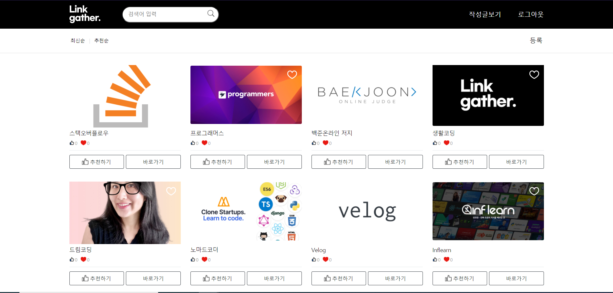
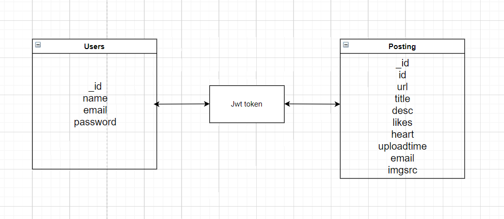

# Hanghae99 Team2 Toy project#1
> 공부하는데 필요한 링크들을 모아서 올릴 수 있는 사이트
* 주소: ()

## 개요
* 프로젝트 명: Link Gather
* 개발기간: 210803~210828
* 개발인원: 김동우, 이지훈, 이미다, 황창환 (4명)

## 프로젝트 계기
> 저희 조는 다행히도(?) 다들 웹개발 초보자였기 때문에 본 부트캠프가 시작하기 전에 어떤 느낌인지 먼저 체험해 보고자 토이 프로젝트를 시작하게 되었습니다.
> 방법은 설계없이 하드코딩과 열정이며, 내용은 미니프로젝트와 동일한 홈페이지 만들기 + 로그인, 회원가입, 인증기능 입니다.
> 4주 동안 문제와 부딪쳐가며 만든 우리 팀원과, 이 프로젝트를 본 다른 항해 팀원들에게 나도 할 수 있겠다는 자신감과 긍정적인 에너지를 주었으면 좋겠습니다😁

## 사용 기술
* Frontend
    * HTML
    * CSS
    * Javascript
  
* Backend
  * Flask
  * MongoDB

* Server
  * AWS
  
## 주요기능
 #### 1. 모달창 기능
  * 로그인, 회원가입, 글작성, 상세보기 모달 기능 사용
 
 #### 2. 반응형 기능
  * 모바일 화면 등에 맞는 반응형 화면 사용
  
 #### 3. 회원가입 및 로그인 기능
  * 회원가입 모달창의 정보를 이용하여 중복성 체크 후 DB에 정보저장 및 회원가입 완료
  * DB에 저장된 회원가입 정보를 이용하여 로그인 여부 확인
  
 #### 4. 특정 기능 접근 권한 부여 기능
  * 글 작성, 내 글목록 기능은 로그인을 통해 발급받은 토큰을 검사해서 사용가능하게 구현
  
 #### 5. 게시글 생성, 읽기, 수정, 삭제 기능
  * 프론트엔드에서 백엔드와 API 통신, DB를 이용하여 게시글의 CRUD 기능 구현
 
 #### 6. 작성글 이미지 스크래핑 기능
  * 백엔드에서 Beautifulsoup4 패키지를 활용하여 url의 og-image를 스크래핑 해 DB에 저장하는 기능 구현
 
 #### 7. 내 작성글 확인 기능
  * 토근 인증 기능을 활용하여 내가 작성한 글만 볼 수 있는 페이지 구현
  
 #### 8. 좋아요 기능
  *  프론트엔드에서 백엔드와 API 통신, DB를 이용하여 게시글의 좋아요 기능 구현
  
 #### 9. 검색 기능
  * 검색어에 해당하는 단어를 DB에서 불러와 정렬해주는 기능 구현
  
 #### 10. 최신순, 추천순 정렬 기능 
  * DB에서 기준에 맞는 정렬을 해주는 기능 구현
  
 #### 11. Jinja를 통해 SSR 기능 구현
  * 권한이 있는 상태일 때, 아닐 때 html구조가 달라지게 하는 기능 구현
  
## DB 구조

## 주요 API
기능|Method|URL|Response
---|---|---|---|
메인페이지 글목록|GET|/|main.html, token
인증실패|GET|/fail|main.html
내 글목록|GET|/myPage|mypage.html, token
내 글목록 내용 뷰|GET|/myPage/list|
글 최신순 정렬|GET|/view|token
글 작성|POST|/test|
글 상세보기|GET|/test/detail|
글 수정하기|GET|/test/edit|
글 삭제하기|POST|/test/delete|
글 수정 제출|POST|/test/submitEdit|
글 검색|GET|/search|search.html, keywords, search, token
이미지 삽입|POST|/create/previewImage|og:image
좋아요 기능|POST|/update/likes|

## 아쉬웠던 점
  #### 1. 설계의 부재
>그냥 문제와 부딪치면서 만드는 방법을 선택했습니다.(하드코딩) 그러다 보니 뭔가 불편하거나 잘못되었다고 인지했을 때,
그것을 고치기가 힘들다는 단점이 존재한다는 것을 느꼈습니다. 
첫번째는 DB 구조에 대한 것이었습니다. 원래는 내 글목록 기능이 아닌 유저가 찜한 글 목록을 보는 페이지를 만들고 싶었으나, 다 만들어 갈 쯤 기존의 방식으로 만들면
배포해서 여러 유저가 사용할 때 찜 기능, 비슷한 좋아요 기능을 표현하는 것이 불가능 하다는 것을 알게 되었습니다.
두번째는 파일 구조화가 세분화 되지 않은 점입니다. 홈페이지에 여러가지 기능이 추가되면서 html, js, py 파일의 내용이 늘어나 충돌하거나 찾기 힘든 내용들이 있었습니다.
한 기능에 관련있는 파일을 모으는 방법이나 코드의 흐름을 정리하며 작성할 필요가 있음을 느꼈습니다.
    
  #### 2. search에서 추천순 최신순 정렬 구현 실패:
  

  
  
  
 
 
  
